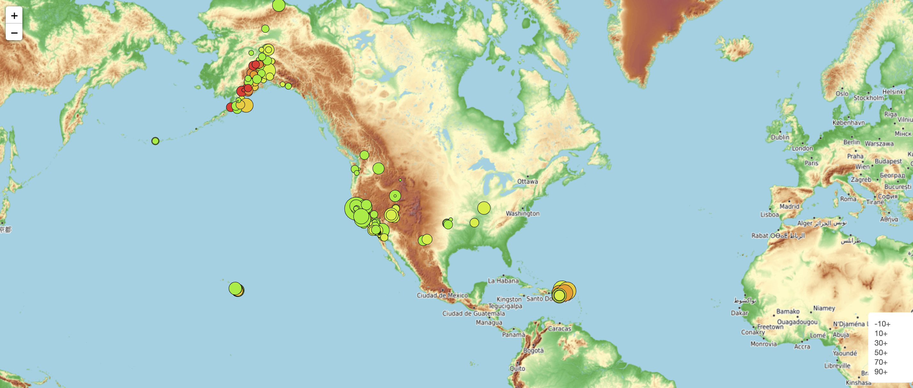

# leaflet_map_visualization

Using USGS GeoJson, earthquake data is plotted on a map of the world. 
https://earthquake.usgs.gov/earthquakes/feed/v1.0/geojson.php

Earthquakes are plotted so that the larger the earthquake, the larger the circle.
Depth of earthquakes are indicated by color with a legend create on the bottom right.

